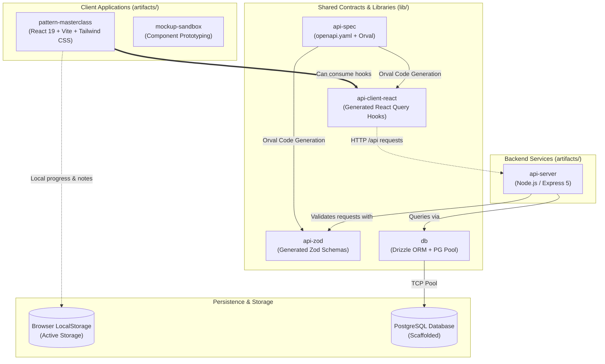
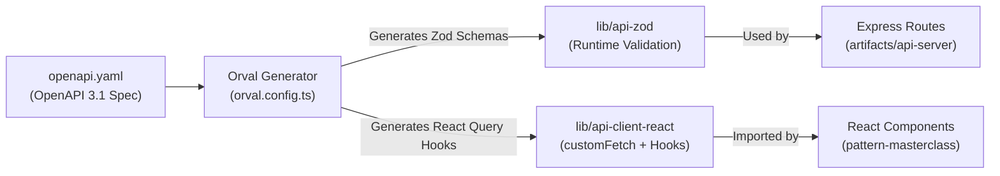
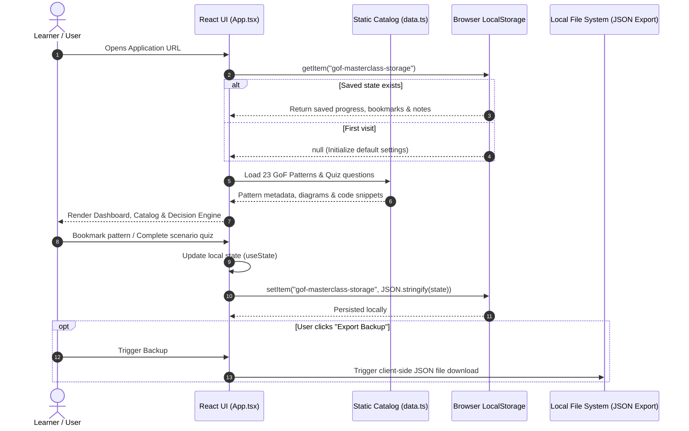
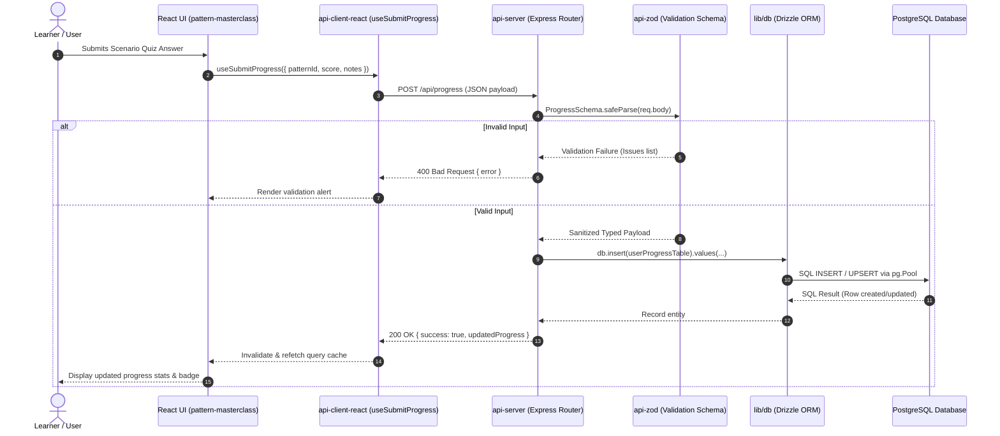

# System Architecture & Design

This document details the architectural structure of the **GoF Design Patterns Masterclass** monorepo, including module responsibilities, API generation pipelines, and sequence diagrams illustrating runtime behavior.

---

## 1. High-Level System Architecture

The project is structured as a **pnpm monorepo** using modular separation between client applications (`artifacts/`), shared protocol packages (`lib/`), and backend services.

---

## 2. API Contract & Code Generation Pipeline

The repository utilizes a **Contract-First Architecture** driven by [lib/api-spec/openapi.yaml](file:///h:/System%20design/design-pattern/replet/design-patterns/lib/api-spec/openapi.yaml). Frontend and backend never write independent type contracts; both derive strictly from OpenAPI.

### Protocol Responsibilities

| Package | Role | Key File |
| :--- | :--- | :--- |
| **`lib/api-spec`** | Single Source of Truth for all API endpoints and models. | [openapi.yaml](file:///h:/System%20design/design-pattern/replet/design-patterns/lib/api-spec/openapi.yaml) |
| **`lib/api-zod`** | Compiles schemas into runtime validators for input/output boundaries. | [src/index.ts](file:///h:/System%20design/design-pattern/replet/design-patterns/lib/api-zod/src/index.ts) |
| **`lib/api-client-react`** | Exports automated React Query hooks with automatic caching and retry logic. | [src/custom-fetch.ts](file:///h:/System%20design/design-pattern/replet/design-patterns/lib/api-client-react/src/custom-fetch.ts) |
| **`artifacts/api-server`** | Implements route handlers, middlewares (CORS, Pino logging), and business rules. | [src/app.ts](file:///h:/System%20design/design-pattern/replet/design-patterns/artifacts/api-server/src/app.ts) |

---

## 3. Sequence Diagram 1: Current Implementation (Client-First Flow)

In the current production build, the learning application executes **completely client-side**. User interaction does not depend on network requests or database availability.

---

## 4. Sequence Diagram 2: Full-Stack Flow (Future Server-Backed Architecture)

When server-side persistence and API routes are connected, data flows through the generated Zod validation and Drizzle ORM layers:

---

## 5. Architectural Quality Attributes

* **Decoupling**: The UI application is independent of the backend implementation. The frontend can run in zero-infrastructure environments (static hosting) or connected to `api-server`.
* **Type Safety from Database to Client**:
  * PostgreSQL Types $\rightarrow$ Drizzle ORM Schema $\rightarrow$ API Spec $\rightarrow$ Zod Validators $\rightarrow$ React Query Hooks $\rightarrow$ React Components.
  * Any contract change in `openapi.yaml` will trigger TypeScript compiler errors during `pnpm run typecheck` across all impacted packages.
* **Fault Tolerance**: If the API server is unavailable, the application can cleanly fallback to browser `localStorage`.
