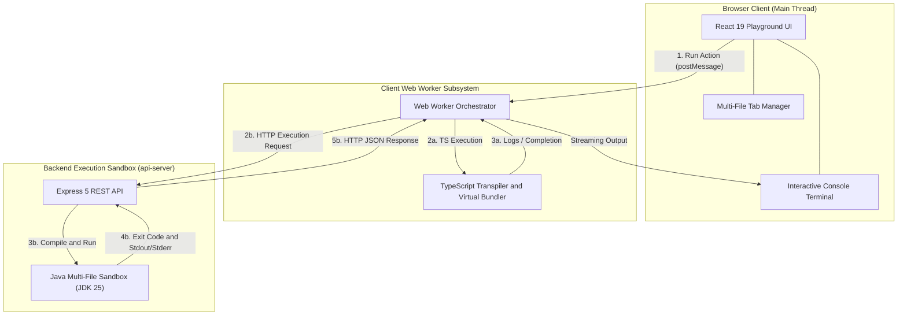
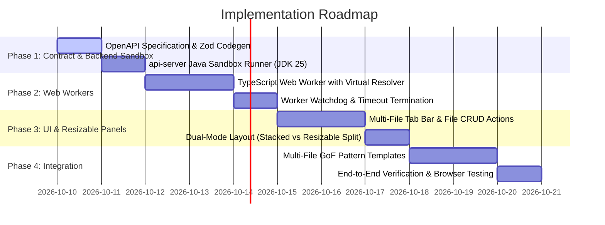

# Product Requirements Document (PRD) & Architecture Specification
## Interactive Multi-File Code Playground Engine (TypeScript & Java)

**Branch**: `feat/code-playground`  
**Status**: APPROVED SPECIFICATION  
**Reference Benchmark**: [OneCompiler (Java & TypeScript)](https://onecompiler.com/java)  
**Target Applications**: `artifacts/pattern-masterclass`, `artifacts/api-server`, `lib/api-spec`

---

## 1. Executive Summary & Problem Statement

### 1.1 The Current Limitation
In the current application, the **Code Playground** (`artifacts/pattern-masterclass/src/App.tsx:L402`) displays static code snippets. Clicking "Run example" does not actually compile or execute user modifications; instead, it evaluates a hardcoded switch statement returning pre-baked strings (e.g. `factory selected: S3StorageDriver`). If a learner modifies code, adds new classes, or experiments with alternate pattern implementations, their changes have no effect. Furthermore, the editor is restricted to a single monolithic textarea without file tabs, making complex multi-class patterns (such as Abstract Factory, Observer, or Strategy) cramped and non-modular.

### 1.2 Target Vision
Transform the Playground into a **production-grade, multi-file interactive coding workshop** inspired by OneCompiler:
1. **Real Execution**: Real-time compilation and execution for both **TypeScript** and **Java**, with an extensible engine ready for future languages (Python, Go, Rust, C#).
2. **Zero-Freeze Web Worker Isolation**: All client-side execution runs off the main browser thread via Web Workers. Infinite loops or fatal runtime crashes never crash or freeze the UI.
3. **Multi-File Tabbed Project Architecture**: Users can view, create, rename, and delete multiple files in a project (e.g. `Main.java`, `Factory.java`, `Product.java` or `index.ts`, `strategy.ts`).
4. **Multi-File Consolidation**: All files in the active project are consolidated and linked together during compilation, invoking the designated entry point.
5. **Interactive Console**: Rich terminal supporting real-time standard output (`stdout`), standard error (`stderr`), compilation diagnostics, execution duration, and exit status.
6. **Zero Double-Scroll Standard**: Exactly 1 unified scroll mechanism—eliminating nested scrollbar traps.
7. **Hybrid Layout with Draggable Sliding Window**: Dual-mode layout enabling seamless toggling between **Stacked Editorial Flow** and **Side-by-Side Resizable Split View** with a draggable divider (`react-resizable-panels`) to manually adjust panel widths.

---

## 2. System Architecture



---

## 3. UI/UX Layout Specification: Dual-Mode with Draggable Sliding Window

### 3.1 Overview of the Hybrid Architecture
To satisfy both spacious editorial reading and side-by-side interactive hacking, the playground incorporates a **Dual-Mode Layout Switcher** located in the playground toolbar:
* **Mode A: Stacked Editorial Flow (Default)**: Editor on top (100% full width), Terminal card directly below.
* **Mode B: Side-by-Side Resizable View (Sliding Window)**: Editor on left, Terminal on right, separated by a draggable splitter handle (`react-resizable-panels`) allowing manual width adjustment.

```text
+-----------------------------------------------------------------------------------------------------------------+
| PLAYGROUND TOOLBAR:                                                                                             |
| [Pattern: Abstract Factory v]  [Java | TS]  [▶ Run (Ctrl+Enter)]  [↺ Reset]  |  [ ⬍ Stacked | ⬄ Side Split ] [⛶ Wide]|
+-----------------------------------------------------------------------------------------------------------------+

MODE A: STACKED EDITORIAL FLOW (Default)
+-----------------------------------------------------------------------------------------------------------------+
| [⭐ Main.java] [GUIFactory.java ×] [WinButton.java ×] [+ New File]                                              |
| 01 | public class Main {                                                                                        |
| 02 |     public static void main(String[] args) { ... }                                                         |
| 03 | }                                                                                                          |
+-----------------------------------------------------------------------------------------------------------------+
| TERMINAL OUTPUT CARD (Directly below — Full-width logs & stack traces)                                          |
| › Status: Finished in 0.38s (Exit 0)                                                                            |
| › [Client] Created WinButton                                                                                    |
+-----------------------------------------------------------------------------------------------------------------+

MODE B: SIDE-BY-SIDE RESIZABLE SPLIT (Sliding Window Handle)
+------------------------------------------------------+||+-------------------------------------------------------+
| [⭐ Main.java] [GUIFactory.java] [+ File]             ||| TERMINAL OUTPUT CONSOLE                               |
| 01 | public class Main {                             ||| › Status: Finished in 0.42s (Exit 0)                  |
| 02 |     GUIFactory f = new WinFactory();            |◀▶| › [Client] Created WinButton                         |
| 03 |     Button b = f.createButton();                ||| › Rendering Windows UI elements                       |
| 04 | }                                               |||                                                       |
|                                                      ||| [ Clear ] [ Copy Output ]                             |
+------------------------------------------------------+||+-------------------------------------------------------+
                 Editor Pane (Drag to Resize)           ^              Terminal Pane (Drag to Resize)
                                                  Draggable Handle
```

### 3.2 Draggable Sliding Window Features (`react-resizable-panels`)
* **Interactive Handle**: A refined vertical splitter with hover highlight, active drag pill (`◀▶`), and double-click to reset to default 65/35 ratio.
* **Constraint Limits**:
  * Minimum Editor Size: 30%
  * Minimum Terminal Size: 20%
  * Default Ratio: 65% Editor / 35% Terminal
* **Dedicated & Wide Canvas Toggles**:
  * Default dedicated width: `max-width: 97.5rem` (1,560px), matching Pattern Studio.
  * Full-bleed toggle (`⛶ Wide`): Expands to 100% viewport width (`calc(100vw - 18rem)`), perfect for ultra-wide multi-file workflows.
* **Responsive Fallback**: On screens $\le 1024px$ (tablets & mobile), the layout automatically locks to **Stacked Flow**, hiding the side-split toggle so smaller screens never suffer from horizontal compression.
* **Persistence**: User preferences (active mode `stacked` vs `split`, panel width percentages, wide canvas state) are persisted in `localStorage`.

---

## 4. Zero Double-Scroll Architecture Standard

> [!WARNING]
> **The Double Scroll Trap**: When an editor container is assigned `height: 500px` with `overflow-y: auto` while the page also scrolls, user scrolling gets trapped inside the editor until it hits the bottom.

### Unified Single-Scroll Implementation:
1. **In Stacked Mode (Mode A)**:
   * The editor body auto-grows to match the code height (`min-height: 24rem`, `max-height: none`).
   * Exactly **1 vertical scrollbar** exists (the main page scroll). Scrolling through code smoothly scrolls the page without trapping.
2. **In Side-by-Side Resizable Mode (Mode B)**:
   * The container locks to viewport height (`height: calc(100vh - 4.5rem)` with `overflow: hidden` on the page).
   * The editor pane and terminal pane each have their own independent, smooth internal scrollbars that fill the pinned viewport height.
   * **Result**: Zero nested scroll chaining in either mode.

---

## 5. Multi-Language Extensibility Architecture (Verified from Official Docs)

| Language | Execution Target | Official Runtime Traps & Risks | Architectural Safeguard |
| :--- | :--- | :--- | :--- |
| **Python** | Client WASM (Pyodide Worker) or Server Sandbox | **Stdout Buffering**: Official Python docs note `sys.stdout` is block-buffered when not connected to a TTY; output streams appear frozen until the process exits. | Set environment variable `PYTHONUNBUFFERED=1` or pass `-u` flag. Client-side runs via **Pyodide** Web Worker. |
| **Go** | Server Sandbox | **Multi-File Package Scope**: In multi-file Go, all files in the directory must declare `package main` and run via `go run .` rather than single-file compilation. | Strategy runner passes directory scope `go run .` within an ephemeral Go module scaffold. |
| **Rust** | Server Sandbox | **Crate Root Requirement**: Rust cannot compile loose `.rs` files without a `main.rs` crate root and module declarations (`mod helper;`). | Provider creates a lightweight `Cargo.toml` and standard `src/` layout. |
| **C# (.NET)** | Server Sandbox | **Top-Level Statements & Assembly references**: .NET requires a `.csproj` or single-file top-level script model. | Uses `dotnet run` within ephemeral project sandbox with pre-warmed SDK cache. |
| **Process Limits** | Server Sandbox | **`maxBuffer` Crashes**: Node.js `child_process.exec` buffers stdout in memory up to 1MB; infinite loops crash the backend process. | Use `child_process.spawn` with streaming chunk listeners capped at 500KB and a hard 5,000ms `SIGKILL` timeout. |

---

## 6. Contract-First API Specification (`lib/api-spec/openapi.yaml`)

```yaml
paths:
  /code/run:
    post:
      operationId: executeCode
      tags: [code-runner]
      summary: Execute multi-file code project
      description: Compiles and executes multi-file code projects in an isolated sandbox
      requestBody:
        required: true
        content:
          application/json:
            schema:
              $ref: "#/components/schemas/ExecuteCodeRequest"
      responses:
        "200":
          description: Code execution completed
          content:
            application/json:
              schema:
                $ref: "#/components/schemas/ExecuteCodeResponse"
        "400":
          description: Invalid request payload
        "500":
          description: Internal execution failure

components:
  schemas:
    CodeFile:
      type: object
      required: [name, content]
      properties:
        name:
          type: string
          example: "Main.java"
        content:
          type: string
          example: "public class Main { public static void main(String[] args) { System.out.println(\"Hello\"); } }"
    
    ExecuteCodeRequest:
      type: object
      required: [language, files]
      properties:
        language:
          type: string
          enum: [java, typescript, python, go, rust, csharp]
          example: "java"
        files:
          type: array
          items:
            $ref: "#/components/schemas/CodeFile"
        entryPoint:
          type: string
          example: "Main.java"
        stdin:
          type: string
          default: ""
        timeoutMs:
          type: integer
          default: 5000
          maximum: 10000

    ExecuteCodeResponse:
      type: object
      required: [status, stdout, stderr, exitCode, durationMs]
      properties:
        status:
          type: string
          enum: [success, compile_error, runtime_error, timeout]
        stdout:
          type: array
          items:
            type: string
        stderr:
          type: array
          items:
            type: string
        exitCode:
          type: integer
        durationMs:
          type: number
```

---

## 7. Phased Implementation Roadmap


